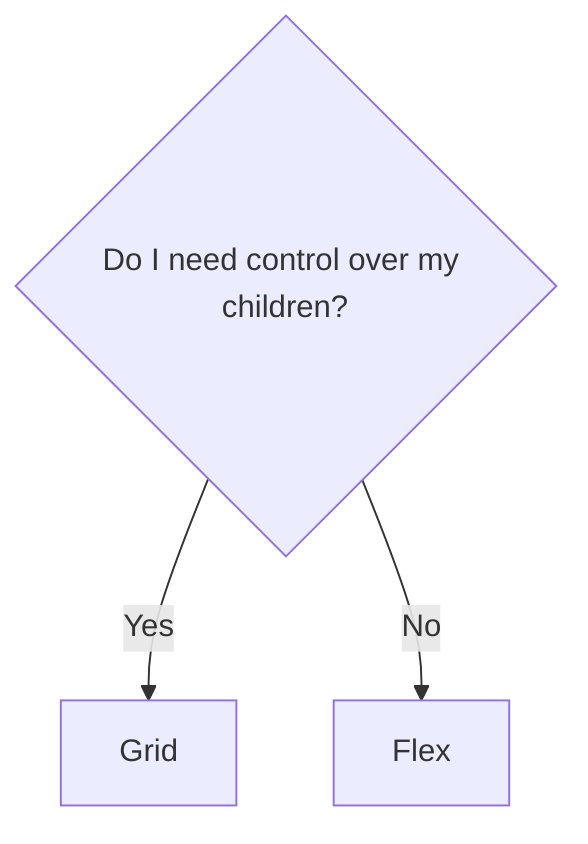

<h1 class="text-balance"><span class="font-black [text-shadow:_2px_2px_4px_black]">A shallow deep-dive in CSS layouts that will</span> <span class="bg-gradient-to-r from-red-500 via-indigo-500 to-red-500 inline-block text-transparent bg-clip-text">BLOW YOUR MIND</span></h1>

<p class="!leading-light"><span>"Really, you can do that?!"</span> <br> <span text-sm>"I don't believe you."</span> <br> <span class="text-[.5rem]">"I wish I was at the other talk."</span> <br> <span class="text-[.3rem]">"Jeez louise, that lunch didn't sit well with me, AT ALL!"</span></p>

---
layout: two-cols
---

<h1>Frontend <span class="text-indigo-500">2014</span></h1>

<v-click>

- holding up fingers to the screen to see if items align

</v-click>

<v-click>

- this:

```css
.clearfix:after {
  content: "";
  display: table;
  clear: both;
}
```

</v-click>

<v-click>

- and this:

```css
.box {
  border-radius: 1em;
  -webkit-border-radius: 1em; // Safari
  -moz-border-radius: 1em; // Firefox
  -o-border-radius: 1em; // Opera
}
```

</v-click>

::right::
<v-click>

<h1>Frontend <span class="text-indigo-500">2024</span></h1>
</v-click>

<v-clicks>

- hopefully not that
- browser harmony
- components `>` cascade
- higher quality component libraries

</v-clicks>

---
layout: quote
---

<div class="grid gap-2 align-center">We're expected to put less emphasis on how we <span> <span class="text-indigo-500 py-1">build</span> components</span>and more on how we <span><span class="text-indigo-500 py-1">place</span> components </span></div>

---
layout: cover
class: text-center bg-gradient-to-r from-black to-indigo-900
transition: slide-up
---

# Layouts

---
transition: slide-left
---

<h1>Your thoughts</h1>


<div class="grid place-items-center">
<Chart />
</div>

---
layout: center
transition: view-transition
---

# KILL IT WITH FIRE {.inline-block.view-transition-title2}

---
layout: image-right
image: hell.png
transition: view-transition
---

# KILL IT WITH FIRE {.inline-block.view-transition-title2}

<v-click>
<p class="mb-4">The easiest way to <span class="text-indigo-500 font-black">center a div!</span> <br>Become popular at work!</p>

```css
display: grid;
place-items: center;
```

<Center />

</v-click>

---
layout: center
transition: view-transition
---

# I avoid it if I can {.inline-block.view-transition-title3}

---
transition: view-transition
---

# I avoid it if I can {.inline-block.view-transition-title3}

... and I get it!

<div class="grid grid-cols-2">
<div>
```html {all|1,6|1,6|2,4|all}{at:1}
<div class="grid">
  <div class="item">
    <div class="my-component">1</div>
  </div>
  <!-- ... -->
</div>
```

```css {all|1-3,12|1-3,12|5-7,11|all}{at:1}
.grid {
  display: flex;
  margin: -2rem;

  .item {
    flex: 1;
    padding: 1rem;

    .my-component {
      /* ... */
    }
  }
}
```

</div>
<div>
  <WithoutGap/>
  <ul class="pl-4">
    <li v-click="+1">Add minus margin corresponding to the <span class="text-indigo-500 font-black">intended</span> <code>gap</code> size on your <code>.grid</code> to offset item padding</li>
    <li v-click="+2">Make sure that margin doesn't break the rest of your layout</li>
    <li v-click="+3">
      Add padding to each item corresponding to <span class="text-indigo-500 font-black">half the gap</span> you intend to
      have
    </li>
    <li v-click="+4">I get it if you found this a little confusing, good.</li>
  </ul>
</div>
</div>

---
transition: view-transition
---

# I avoid it if I can

`gap` allows you to <span class="text-indigo-500 font-black">declutter</span> your code!

<div class="grid grid-cols-2 gap-4">
  <div>
````md magic-move {at:1}
```html
<div class="grid">
  <div class="item">
    <div class="my-component">1</div>
  </div>
  <!-- ... -->
</div>
```
```html
<div class="grid">
  <div class="my-component">1</div>
  <!-- ... -->
</div>
```
````

````md magic-move {at:1}
```css
.grid {
  display: flex;
  margin: -2rem;

  .item {
    flex: 1;
    padding: 1rem;

    .my-component {
      /* ... */
    }
  }
}
```
```css
.grid {
  display: flex;
  gap: 1rem;

  .my-component {
    /* ... */
  }
}
```
````
</div>

<v-click at="+1">
<div>
  <WithGap/>

  <ul class="mt-2">
    <li>Set your desired <code>gap</code></li>
    <li>Done!</li>
  </ul>
  </div>
</v-click>
</div>


---
transition: slide-left
---

# I avoid it if I can

`gap` allows you to <span class="text-indigo-500 font-black">declutter</span> your code <span v-mark="1">and stay closer to <span class="text-indigo-500 font-black">standards</span></span>!

<div class="grid grid-cols-2 gap-4">
  <div class="relative">
```jsx {all|0|all}{at:1}
// Sad MUI example like it says in the docs
<Grid container spacing={2}>
  {items.map((item) => (
    <Grid xs={4} key={item.sad}>
      <MyComponent />
    </Grid>
  ))}
</Grid>
```

```jsx {0|all}{at:1}
// Joy-sparking MUI example
<Box sx={{ display: "flex", gap: 2 }}>
  {items.map((item) => (
    <MyComponent key={item.joy} />
  ))}
</Box>
```

  </div>
    <WithGap/>
</div>

---
layout: center
transition: view-transition
---

# Ok, I guess {.inline-block.view-transition-title4}

---
transition: view-transition
---

# Ok, I guess {.inline-block.view-transition-title4}

<span v-if="$clicks <= 0">When do I use `grid` or `flex`?</span>
<span v-else-if="$clicks < 5">Use `grid`...</span>
<span v-else>Use `flex`...</span>

<div class="grid grid-cols-2 gap-8 transition-all ease-out" :class="$clicks > 0 && 'pt-8'">
<div>
<div class="flex w-full aspect-[1.2/1] transition-all ease-out duration-500" :class="$clicks <= 0 ? 'translate-[0]': 'translate-x-[260px] translate-y-[-250px]'">

</div>
<div class="transition-all ease-out duration-700 -translate-y-[200px]">
<v-clicks>

<IconListItem align="right" text="Grid!"><carbon-grid /> </IconListItem>
<IconListItem align="right" text="Stack my children"><carbon-grid /> </IconListItem>
<IconListItem align="right" text="Avoid media queries"><carbon-grid /> </IconListItem>
<IconListItem align="right" text="Advanced layouts"><carbon-grid /> </IconListItem>
</v-clicks>
</div>
</div>

<div class="transition-all ease-out duration-700 translate-y-[148px]">
<v-click>
<IconListItem text="Row of children"><carbon-events/> </IconListItem>
</v-click>
<v-click>
<IconListItem text="Don't care what my children looks like"><carbon-events/> </IconListItem>
</v-click>
</div>


</div>


---
transition: none
---

# Ok, I guess

Control my children?

---

# I enjoy it!

---

# LET ME TELL YOU ABOUT `subgrid`!

```

```

```

```
