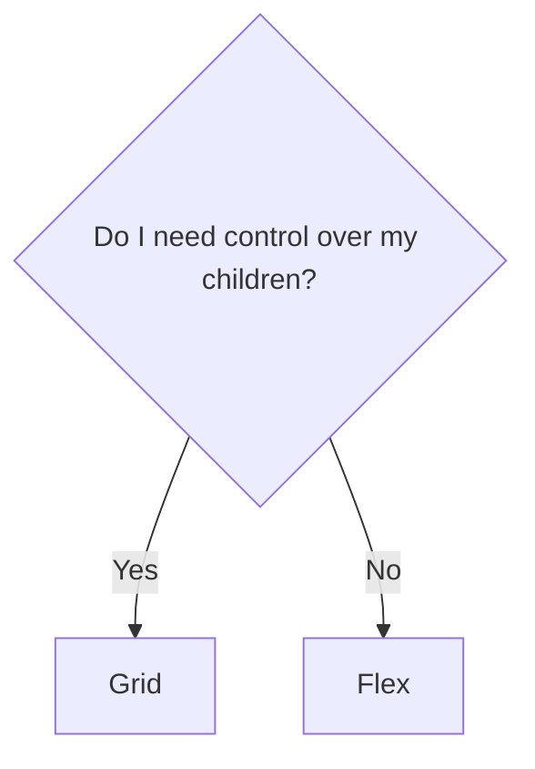

<!--
testing
-->
---
layout: cover
background: exploding-head.gif
---

<h1 class="text-balance"><span class="font-black [text-shadow:_2px_2px_4px_black]">A shallow deep-dive in CSS layouts that will</span> <span class="bg-gradient-to-r from-red-500 via-indigo-500 to-red-500 inline-block text-transparent bg-clip-text">BLOW YOUR MIND</span></h1>


---
layout: image-right
image: me.jpeg
transition: view-transition
---

# Felix Bohlin
<p><span class="view-transition-title">Frontend</span> developer, Devotion</p>

<IconText text="Currently at Coor"><fluent:laptop-24-regular /></IconText>
<IconText text="Wife, son & two fluffy cats"><fluent:heart-24-regular /></IconText>
<IconText text="Gullmarsplan & Skuggorna Bakom Oss"><fluent:music-note-2--24-regular /></IconText>
<v-click>

</v-click>

---
transition: view-transition
layout: center
---

# Frontend {.view-transition-title}

<!--
This talk is about CSS and some of the cool things we can do with it today, but let's start by going back in time a bit.
-->

---
layout: two-cols
---

<h1><span class="view-transition-title">Frontend</span> <span class="text-indigo-500">2014</span></h1>

- holding up fingers to the screen to see if items align
- this:

```css
.clearfix:after {
  content: "";
  display: table;
  clear: both;
}
```

- and this:

```css
.box {
  border-radius: 1em;
  -webkit-border-radius: 1em; // Safari
  -moz-border-radius: 1em; // Firefox
  -o-border-radius: 1em; // Opera
}
```

::right::
<v-click>

<h1>Frontend <span class="text-indigo-500">2024</span></h1>

- hopefully not that anymore
- browser harmony
- components `>` cascade
- higher quality component libraries

</v-click>

<!--
The responsibilities of UI developers has changed a lot in the last 10-15 years. Responsive design and mobile first was a cool buzzword! The web environment was very fragmented - browser support for JS and CSS was different wherever you looked.

Remember fixing that thing in Internet Explorer 11 only for it to not work in Internet Explorer 10? All this shaped the frontend role into a highly specialized field. It put a lot of emphasis on finding and coming up with black magic hacks and knowing the intricacies of all the stuff you wanted to use.

[click] That's not everything it was of course, but without that you were lost.

The modern frontend role has shifted away from that, and the expectations on UI developers have as well. Browser vendors are nowadays in-sync with each other and working together to ship features. Web apps with Javscript frameworks alongside these endlessly configurable and well-documented component libraries makes for a fairly time-efficient way to ship features nowadays. No more weird clearfix or aspect ratio hacks, no more self-maintained components
-->

---
layout: quote
---

<div class="grid gap-2 align-center">We're expected to put less emphasis on how we <span> <span class="text-indigo-500 py-1">build</span> components</span>and more on how we <span><span class="text-indigo-500 py-1">place</span> components </span></div>

<!--
We are at that stage where we're expected to put less emphasis on how we build components and more on how we place them.

And that will be the focus of this talk today - LAYOUTS.
-->

---
transition: slide-up
---

# What this talk is
A shallow deep-dive in CSS layouts that will BLOW YOUR MIND

<div class="mt-12"></div>

- I want to show what's possible with CSS at different levels of complexity

<v-clicks>

- Applicable to any environment - vanilla CSS, SASS, Tailwind, Material UI etc
- "CSS is better than X" is not what I'm going for
</v-clicks>

<v-click>
<SparksJoy text="Spark joy!" class="!justify-start mt-4" />
</v-click>

<!--
You can't stay up to date with everything, so I'd like to give you a sneak peek into how you could build a mental model around CSS and a little how I go about things.

[click] I want to be clear that all the tips today are applicable in any project environment.

[click] Someone here at Regent acutally told me the other day: "why would I write CSS if my current component library already has components that can handle most of my layout needs?"

Good point. Perhaps you shouldn't! Perhaps you should! I'm not necessarily here to sell you a better solution. All I hope to do is inspire and hopefully...

[click] spark joy! CSS!!!!!
-->

---
transition: slide-left
---

<h1>Your thoughts</h1>


<div class="grid place-items-center">
<Chart />
</div>


---
layout: center
transition: view-transition
class: text-center bg-gradient-to-r from-black to-indigo-900
---

# KILL IT WITH FIRE {.inline-block.view-transition-title2}

<!--
Well, some of the respondents just had zero feelings for CSS, so there's nothing I can say to change your mind.

However...
-->

---
layout: image-right
image: hell.png
transition: slide-left
---

# KILL IT WITH FIRE {.inline-block.view-transition-title2}

<v-click>
<p class="mb-4">The easiest way to <span class="text-indigo-500 font-black">center a div!</span> <br>Become popular at work!</p>

```css
div {
  display: grid;
  place-items: center;
}
```

<Center />

</v-click>

<!--
What I can do for you...


[click] ... is perhaps become popular among your colleagues with your cool CSS party tricks!
-->

---
layout: center
transition: view-transition
class: text-center bg-gradient-to-r from-black to-indigo-900
---

# I avoid it if I can {.inline-block.view-transition-title3}

<!--
Some of you weren't as hostile, but still hesitant. There's a lot of reasons why that is, but I think frustration with the simplest of stuff definitely can contribute.
-->

---
transition: view-transition
layout: center
---

# I avoid it if I can {.flow-root.text-center.view-transition-title3}

<WithoutGap :noBorders="$slidev.nav.clicks <= 0"/>

<v-click>
<div></div>
</v-click>

<!--
These boxes are probably a great reason why I think people try to avoid CSS. HOW HARD CAN IT BE to put a couple of items in a row like this with a little spacing??

In the olden days, doing layouts was half the reason you used something like Bootstrap or Foundation

[click] because achieving this result was more work than you really wanted.

Let's see why this is how it is and how to make your lives simpler!
-->

---
transition: fade-out
---

# I avoid it if I can {.flow-root.view-transition-title3}

... and I get it!

<div class="grid grid-cols-2">
<div>
```html {all|1,6|2,4|all}{at:1}
<div class="row">
  <div class="col">
    <div class="my-component">1</div>
  </div>
  <!-- ... -->
</div>
```

```css {all|1-3,12|5-7,11|all}{at:1}
.row {
  display: flex;
  margin: -2rem;

  .col {
    flex: 1;
    padding: 1rem;

    .my-component {
      /* ... */
    }
  }
}
```

</div>
<div>
  <WithoutGap/>
</div>
</div>

<!--
This is what you had to do to get some boxes with some spacing!

[click] Add minus margin corresponding to the intended gap size on your .grid to offset item padding

Make sure that margin doesn't break the rest of your layout

[click] Add padding to each item corresponding to half the gap you intend to have

[click] I get it if you found this a little confusing, it is. IF ONLY there was a way to just say "I want to loop out some boxes and put some gap between them!"
-->

---
transition: view-transition
---

# I avoid it if I can

`gap` allows you to <span class="text-indigo-500 font-black">declutter</span> your code!

<div class="grid grid-cols-2 gap-4">
  <div>
````md magic-move {at:1}
```html
<div class="row">
  <div class="col">
    <div class="my-component">1</div>
  </div>
  <!-- ... -->
</div>
```
```html
<div class="row">
  <div class="my-component">1</div>
  <!-- ... -->
</div>
```
````

````md magic-move {at:1}
```css
.row {
  display: flex;
  margin: -2rem;

  .col {
    flex: 1;
    padding: 1rem;

    .my-component {
      /* ... */
    }
  }
}
```
```css
.row {
  display: flex;
  gap: 1rem;

  .my-component {
    /* ... */
  }
}
```
````

</div>

<v-click at="+1">
<div>
  <WithGap/>

  <ul class="mt-2">
    <li>Set your desired <code>gap</code></li>
    <li>Done!</li>
  </ul>
  </div>
</v-click>
</div>

<!--
Enter our hero `gap`!
It basically takes us from this....

[click] ... to this

Keep using Bootstrap if you want, it's a remarkable tool! I just want to show you how much easier many of the common day-to-day things have gotten.

On a side-note, whatever you think of Tailwind, I think they've done a terrific job of highlighting how easy something like this is too.
-->

---
transition: slide-left
---

# I avoid it if I can

`gap` allows you to <span class="text-indigo-500 font-black">declutter</span> your code!

<div class="grid grid-cols-2 gap-4">
  <div class="relative">
```jsx {all|0|all}{at:1}
// MUI - straight from the docs
<Grid container spacing={2}>
  {items.map((item) => (
    <Grid xs={4} key={item.sad}>
      <MyComponent />
    </Grid>
  ))}
</Grid>
```

```jsx {0|all}{at:1}
// MUI - sparking joy
<Box sx={{ display: "flex", gap: 2 }}>
  {items.map((item) => (
    <MyComponent key={item.joy} />
  ))}
</Box>
```

  </div>
  <div class="grid gap-2">
    <WithoutGap :class="$slidev.nav.clicks === 1 && 'opacity-50'" />
    <WithGap class="mx-13" :class="$slidev.nav.clicks === 0 && 'opacity-50'"/>
  </div>
</div>

<!--
Here's a Material UI-example taken straight from their docs.
I wanted to show you a quick example since I know it's very popular and a lot of you have come in contact with it.

In my assignment we've completely omitted layout helpers entirely and gone the vanilla CSS-way wherever possible.

[click] The developers "stuck with styling" are happy because they get to write as few lines of CSS as possible. As the FE maintainer I'm happy to decrease clutter without veering away from standards.

[click] Both approaches are totally valid and well-documented.
`Gap` however is too important to miss, so even though you want to avoid CSS, maybe don't avoid this one!
-->

---
layout: center
transition: view-transition
class: text-center bg-gradient-to-r from-black to-indigo-900
---

# Ok, I guess {.inline-block.view-transition-title4}

<!--
Most of you in the poll thought CSS was tolerable, which is fun, but there can still be a lot of confusions.

I've asked quite a lot of people (and it would be fun to poll this in the slack channel)
when they use grid and when they use flex.

Almost everyone I asked replied that they've never gotten into grid and just use flex.  (raise of hands, IS THAT TRUE?).

As much as I think `gap` is something you can't miss,
from now on, I'd like to argue that `grid` is equally something you want to check out!

BUT WHEN DO YOU USE `grid` and when do you use `flex`?
-->

---
transition: slide-left
---

# Ok, I guess {.inline-block.view-transition-title4}

When do I use <span v-mark="{at:1}"><code>grid</code></span> or <span v-mark="{at:5}"><code>flex</code></span>?

<div class="grid grid-cols-2 gap-8 transition-all ease-out" :class="$clicks > 0 && 'pt-8'">
<div>
<div class="flex w-full aspect-[1.2/1] transition-all ease-out duration-500" :class="$clicks <= 0 ? 'translate-[0]': 'translate-x-[260px] translate-y-[-250px]'">

</div>
<div class="transition-all ease-out duration-700 -translate-y-[200px]">
<v-clicks>

<IconText align="right" text="(two-dimensional) Grids"><fluent:grid-24-regular /></IconText>
<IconText align="right" text="Stacking"><fluent:grid-24-regular /></IconText>
<IconText align="right" text="Avoid media queries"><fluent:grid-24-regular /></IconText>
<IconText align="right" text="Advanced layouts"><fluent:grid-24-regular /></IconText>
</v-clicks>
</div>
</div>

<div class="transition-all ease-out duration-700 translate-y-[148px]">
<v-click>
<IconText class="-ml-4.5" text="Rows"><fluent:people-community-24-regular/></IconText>
</v-click>
<v-click>
<IconText class="-ml-4.5" text="Don't care what my children look like"><fluent:people-community-24-regular/></IconText>
</v-click>
</div>


</div>

<!--
[click] Two-dimensional grids - grid is great when you need to control your layouts in two dimensions

[click] Stacking - instead of flex-direction: column - just use grid! Grid is vertical by default. It's perfect when you have stacked items and want equal gap between them.

Another type of stacking could be page layouts (header, main, footer)

[click] Grid is great when you want to avoid writing media queries. There's a lot built into grid that flex just can't do that lets you avoid some media queries (more about that later!)

[click] Advanced layouts - product cards you find in web stores are a great examples where grid is super useful! When the cards get resized, some elements need to change position completely. Thanks to `grid-area` you can achieve this without a single line of Javascript - helping you to declutter your code significantly.

[click] Rows are the classic flex example, and it's great for that!

[click] Especially when you don't care about the size of your children. Grid is particular about each child fitting into it's grid (doh). Flex meanwhile is just happy with anything, so you can end up with a row of small, large, microscopic children, if that's what you want!
-->

---
class: text-center bg-gradient-to-r from-black to-indigo-900
layout: center
transition: view-transition
---

# I enjoy it! {.inline-block.view-transition-title5}

<!--
Penultimate level!

Originally I was going to name this talk "CSS one-liners" something something and just talk about that, but then I was made aware that people, at best, tolerate CSS.

HOWEVER, I managed to save one one-liner from the garbage pile!
-->

---
transition: view-transition
---

# I enjoy it! {.inline-block.view-transition-title5}

Let's replace media/container queries with nifty one-liners!

<div class="grid grid-cols-2 gap2">
```css {all|0}{at: 1}
.grid {
  display: grid;
  gap: 1rem;
  grid-template-columns: 1fr;

  @media (width > var(--breakpoint-md)) {
    grid-template-columns: 1fr 1fr;
  }

  @media (width > var(--breakpoint-lg)) {
    grid-template-columns: 1fr 1fr 1fr 1fr;
  }
}

```

```tsx {0|all}{at: 1}
<Box sx={{
  display: "grid",
  gap: 1rem,
  gridTemplateColumns: {
    xs: '1fr',
    md: 'repeat(2, 1fr)',
    lg: 'repeat(4, 1fr)',
  },
}}>
  {fields.map((item) => item)}
</Box>
```
</div>

<div class="gap-4 rounded p-2 border-2 border-zinc-500/50 grid grid-cols-[repeat(auto-fit,minmax(150px,1fr))] overflow-auto resize">
  <input type="text" placeholder="First name" class="p-2 w-full bg-gray-100 grid place-items-center rounded max-h-[40px] bg-transparent border-1 border-gray-100" />
  <input type="text" placeholder="Last name" class="p-2 w-full bg-gray-100 grid place-items-center rounded max-h-[40px] bg-transparent border-1 border-gray-100" />
  <input type="text" placeholder="Email" class="p-2 w-full grid place-items-center rounded max-h-[40px] bg-transparent border-1 border-gray-100" />
  <select class="p-2 w-full grid place-items-center rounded max-h-[40px] bg-transparent border-1 border-gray-100">
    <option value="" disabled selected>Choose stuff</option>
  </select>
</div>

<!--
This is not an uncommon exmaple.
You have a settings page, a simple form, cards, buttons or anything else in a row.

[resize] Then you remember that the component has to be responsive and you start adding media queries to fix that.

Obviously you started checking out `grid` since you heard a lunatic talk about it at a conference at some point

[click] ... you even used `grid` in your Material UI environment and combined that with some cool breakpoint tricks you found in their documentation! You even snuck in a `repeat` function, NICE TOUCH!

BUT WHAT IF we could get rid of all these breakpoints and media queries??
-->

---
transition: none
---

# I enjoy it!
Replace media queries with nifty one-liners


```css {4}{at:0}
form {
  display: grid;
  gap: 1rem;
  grid-tempalte-columns: repeat(auto-fit, minmax(30ch, 1fr));
}
```

<!--
With one seemingly complex but simple line of code, you can achieve quite a lot! Let's break it down!

1. `grid-template-colums` property helps us create columns in our grid
2. the `repeat` function lets us decide
      - how many times we want to repeat our items and
      - how large they should be.
      This time we just want to "keep 'em coming", ie `auto-fit`
3. As an icing on the cake we use the `minmax` function to tell `grid` that our items in this case can't be less than 30 characters wide but can be as wide as they can get.

Let's see an example of how you can use this!
-->

---
transition: fade-out
---

# I enjoy it!
Replace media queries with nifty one-liners

<div class="grid gap-2">
<Suspense>
  <BoxGrid/>
</Suspense>

<v-click at="+1">
<SparksJoy class="absolute top-10 right-20 !justify-end flex items-center"/>
</v-click>
</div>

<!--
The nice thing here is that you can tweak one value here and get the exact layout you want depending on your design requirements.

It's not a solution for every problem like this obviously - some cases require more hand holding, but it's a really nice one-liner that, if you don't like CSS, can save you from writing, and if you do like it, make you feel like a rockstar!

Regardless it will...


[click] spark joy!
-->

---
class: text-center bg-gradient-to-r from-black to-indigo-900
layout: center
---
# LET ME TELL YOU ABOUT `subgrid`!

<!--
When you add display: grid to a grid container, only the direct children become grid items and can then be placed on the grid you created.
The children of the children gets displayed in the normal flow.

Why can this be a problem?
-->

---
---
# LET ME TELL YOU ABOUT `subgrid`!

<Cards />


<!--
As you can see here we've hit a dead end.
[inspect] By looking at the layout here we can clearly see that the nested children here are the culprits!

If we only had a way for the children to adhere to the layout's grid!!!


OH WAIT!
-->


---
class: text-center bg-gradient-to-r from-black to-indigo-900
layout: center
---

# Thank you!
