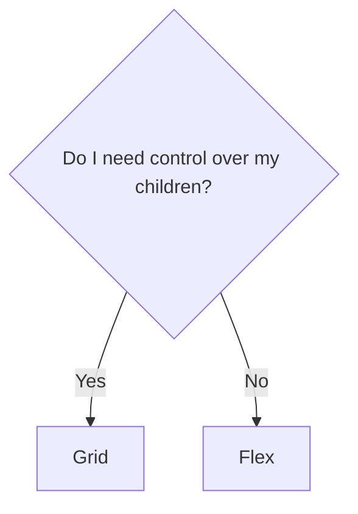

<h1 class="text-balance"><span class="font-black [text-shadow:_2px_2px_4px_black]">CSS one-liners that will</span> <span class="bg-gradient-to-r from-red-500 via-indigo-500 to-red-500 inline-block text-transparent bg-clip-text">BLOW YOUR MIND</span></h1>

<p class="text-2xl">You won't believe number 9!!</p>


---
layout: two-cols
---
<h1>Frontend <span class="text-indigo-500">2014</span></h1>


<v-click>

- holding up fingers to the screen to see if items align

</v-click>

<v-click>

- this:

```css
.clearfix:after {
  content: "";
  display: table;
  clear: both;
}
```
</v-click>

<v-click>

- and this:

```css
.box {
  border-radius: 1em;
  -webkit-border-radius: 1em; // Safari
  -moz-border-radius: 1em; // Firefox
  -o-border-radius: 1em; // Opera
}
```
</v-click>


::right::
<v-click>

<h1>Frontend <span class="text-indigo-500">2024</span></h1>
</v-click>

<v-clicks>

- hopefully not that
- browser harmony
- components `>` cascade
- higher quality component libraries

</v-clicks>

---
layout: quote
---
<div class="grid gap-2 align-center">We're expected to put less emphasis on how we <span> <span class="text-indigo-500 py-1">build</span> components</span>and more on how we <span><span class="text-indigo-500 py-1">place</span> components </span></div>


---
layout: cover
class: text-center bg-gradient-to-r from-black to-indigo-900
transition: view-transition
---

# Layouts {.inline-block.view-transition-title}

---
transition: fade-out
---

<div class="grid grid-cols-[1fr_2fr] h-full">
<div>
<h1 class="inline-block view-transition-title">Opinions</h1>

1. Kill it with fire
2. I avoid it if I can
3. Ok I guess
4. I enjoy it!
5. Let me tell you about `subgrid`!
</div>

<div class="grid place-items-center h-full">
<Chart />
</div>
</div>


---
layout: image-right
image: hell.png
---
# KILL IT WITH FIRE

<v-click>

<p class="mb-4">The easiest way to <span class="text-indigo-500 font-black">center a div!</span> <br>Become popular at work!</p>

```css
display: grid;
place-items: center;
```

<Center />

</v-click>

---


---

# I avoid it if I can


---

# Ok I guess

## When do I use `grid` or `flex`?

<div v-click class="grid place-items-center">

</div>

---

# I enjoy it!

---

# LET ME TELL YOU ABOUT `subgrid`!


