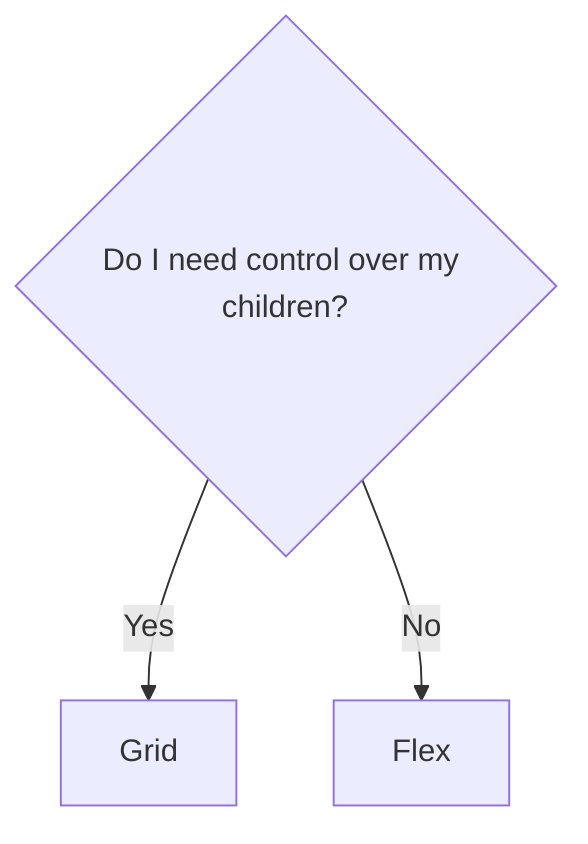

# CSS one-liners that will BLOW YOUR MIND

<p class="text-2xl">You won't believe number 9!!</p>

<style>
  h1  {
  font-weight: 900;
  text-wrap: balance;
  text-shadow: 2px 2px 4px black;
}
</style>

---
layout: two-cols
---

# Frontend 2014

- holding up fingers to the screen to see if items align
- this:

```css
.clearfix:after {
  content: "";
  display: table;
  clear: both;
}
```

- and this:

```css
.box {
  border-radius: 1em;
  -webkit-border-radius: 1em; // Safari
  -moz-border-radius: 1em; // Firefox
  -o-border-radius: 1em; // Opera
}
```

::right::

# Frontend 2024

---

---

# Kill it with fire

---

---

# Impress everyone at work

---

---

# I avoid it if I can

---

---

# Ok I guess

## When do I use `grid` or `flex`?

<div v-click class="grid place-items-center">

</div>

---

---

# I enjoy it!

---

---

# LET ME TELL YOU ABOUT `subgrid`!

---

---


---

layout: image-right
image: https://source.unsplash.com/collection/94734566/1920x1080

---

# Code

Use code snippets and get the highlighting directly, and even types hover![^1]

```ts {all|5|7|7-8|10|all} twoslash
// TwoSlash enables TypeScript hover information
// and errors in markdown code blocks
// More at https://shiki.style/packages/twoslash

import { computed, ref } from "vue";

const count = ref(0);
const doubled = computed(() => count.value * 2);

doubled.value = 2;
```

<arrow v-click="[4, 5]" x1="350" y1="310" x2="195" y2="334" color="#953" width="2" arrowSize="1" />

<!-- This allow you to embed external code blocks -->

<<< @/snippets/external.ts#snippet

<!-- Footer -->

[^1]: [Learn More](https://sli.dev/guide/syntax.html#line-highlighting)

<!-- Inline style -->
<style>
.footnotes-sep {
  @apply mt-5 opacity-10;
}
.footnotes {
  @apply text-sm opacity-75;
}
.footnote-backref {
  display: none;
}
</style>

---

# Components

<div grid="~ cols-2 gap-4">
<div>

You can use Vue components directly inside your slides.

We have provided a few built-in components like `<Tweet/>` and `<Youtube/>` that you can use directly. And adding your custom components is also super easy.

```html
<Counter :count="10" />
```

<!-- ./components/Counter.vue -->
<Counter :count="10" m="t-4" />

Check out [the guides](https://sli.dev/builtin/components.html) for more.

</div>
<div>

```html
<Tweet id="1390115482657726468" />
```

<Tweet id="1390115482657726468" scale="0.65" />

</div>
</div>

<!--
Presenter note with **bold**, *italic*, and ~~striked~~ text.

Also, HTML elements are valid:
<div class="flex w-full">
  <span style="flex-grow: 1;">Left content</span>
  <span>Right content</span>
</div>
-->
