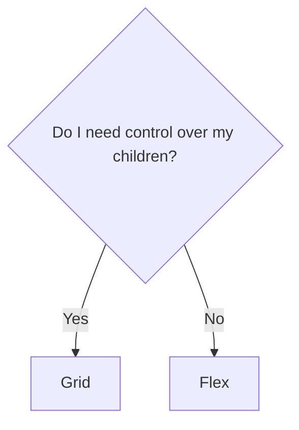

<!--
testing
-->
---
layout: cover
background: exploding-head.gif
---

<h1 class="text-balance"><span class="font-black [text-shadow:_2px_2px_4px_black]">A shallow deep-dive in CSS layouts that will</span> <span class="bg-gradient-to-r from-red-500 via-indigo-500 to-red-500 inline-block text-transparent bg-clip-text">BLOW YOUR MIND</span></h1>


---
layout: image-right
image: me.jpeg
transition: view-transition
---

# Felix Bohlin
<p><span class="view-transition-title">Frontend</span> developer, Devotion</p>

<IconText text="Currently at Coor"><fluent:laptop-24-regular /></IconText>r
<IconText text="Wife, son & two fluffy cats"><fluent:heart-24-regular /></IconText>
<IconText text="Gullmarsplan & Skuggorna Bakom Oss"><fluent:music-note-2--24-regular /></IconText>
<v-click>

</v-click>

---
transition: view-transition
layout: center
---

# Frontend {.view-transition-title}

<!--
Obviously we're going to talk about frontend, but let's start with going back in time a bit.
-->

---
layout: two-cols
---

<h1><span class="view-transition-title">Frontend</span> <span class="text-indigo-500">2014</span></h1>

- holding up fingers to the screen to see if items align
- this:

```css
.clearfix:after {
  content: "";
  display: table;
  clear: both;
}
```

- and this:

```css
.box {
  border-radius: 1em;
  -webkit-border-radius: 1em; // Safari
  -moz-border-radius: 1em; // Firefox
  -o-border-radius: 1em; // Opera
}
```

::right::
<v-click>

<h1>Frontend <span class="text-indigo-500">2024</span></h1>

- hopefully not that anymore
- browser harmony
- components `>` cascade
- higher quality component libraries

</v-click>

<!--
The responsibilities of UI developers has changed a lot in the last 10-15 years. Responsive design and mobile first was a cool buzzword! The web environment was very fragmented - browser support for JS and CSS was different wherever you looked.

Remember fixing that thing in Internet Explorer 11 only for it to not work in Internet Explorer 10? All this shaped the frontend role into a highly specialized field. It put a lot of emphasis on finding and coming up with black magic hacks and knowing the intricacies of all the stuff you wanted to use.

[click] That's not everything it was of course, but without that you were lost.

The modern frontend role has shifted away from that, and the expectations on UI developers have as well. Browser vendors are nowadays in-sync with each other and working together to ship features. Web apps with Javscript frameworks alongside these endlessly configurable and well-documented component libraries makes for a fairly time-efficient way to ship features nowadays. No more weird clearfix or aspect ratio hacks, no more self-maintained components
-->

---
layout: quote
---

<div class="grid gap-2 align-center">We're expected to put less emphasis on how we <span> <span class="text-indigo-500 py-1">build</span> components</span>and more on how we <span><span class="text-indigo-500 py-1">place</span> components </span></div>

<!--
We are at that stage where we're expected to put less emphasis on how we build components and more on how we place them
-->

---
transition: slide-up
---

# What this talk is
A shallow deep-dive in CSS layouts that will BLOW YOUR MIND

<div class="mt-12"></div>

<v-clicks>

- "CSS is better than X" is beside the point
- I want to show what's possible with CSS at different levels of complexity
- Applicable to any environment - vanilla CSS, SASS, Tailwind, Material UI
</v-clicks>

<v-click>
<SparksJoy text="Spark joy!" class="!justify-start mt-4" />
</v-click>

<!--
[click] Someone recently said to me "why would I write CSS if my current component library already has components that can handle most of my layout needs?"

Good for you!

[click] You can't stay up to date with everything, so I'd like to give you a sneak peek into how you could build a mental model around CSS and a little how I go about things.
-->

---
transition: slide-left
---

<h1>Your thoughts</h1>


<div class="grid place-items-center">
<Chart />
</div>


---
layout: center
transition: view-transition
class: text-center bg-gradient-to-r from-black to-indigo-900
---

# KILL IT WITH FIRE {.inline-block.view-transition-title2}

---
layout: image-right
image: hell.png
transition: slide-left
---

# KILL IT WITH FIRE {.inline-block.view-transition-title2}

<v-click>
<p class="mb-4">The easiest way to <span class="text-indigo-500 font-black">center a div!</span> <br>Become popular at work!</p>

```css
display: grid;
place-items: center;
```

<Center />

</v-click>

<!--
I won't be able to convince you! :D
-->

---
layout: center
transition: view-transition
class: text-center bg-gradient-to-r from-black to-indigo-900
---

# I avoid it if I can {.inline-block.view-transition-title3}

---
transition: view-transition
layout: center
---

# I avoid it if I can {.inline-block.text-center.view-transition-title3}

<WithoutGap :noBorders="$slidev.nav.clicks <= 0"/>

<v-click>
<div></div>
</v-click>
---
transition: fade-out
---

# I avoid it if I can {.flow-root.view-transition-title3}

... and I get it!

<div class="grid grid-cols-2">
<div>
```html {all|1,6|1,6|2,4|all}{at:1}
<div class="grid">
  <div class="item">
    <div class="my-component">1</div>
  </div>
  <!-- ... -->
</div>
```

```css {all|1-3,12|1-3,12|5-7,11|all}{at:1}
.grid {
  display: flex;
  margin: -2rem;

  .item {
    flex: 1;
    padding: 1rem;

    .my-component {
      /* ... */
    }
  }
}
```

</div>
<div>
  <WithoutGap/>
</div>
</div>

<!--
In the olden days, doing layouts were half the reason you used something like Bootstrap or Foundation.

[click] Add minus margin corresponding to the intended gap size on your .grid to offset item padding

[click] Make sure that margin doesn't break the rest of your layout

[click] Add padding to each item corresponding to half the gap you intend to have

[click] I get it if you found this a little confusing, it is.
-->

---
transition: view-transition
---

# I avoid it if I can

`gap` allows you to <span class="text-indigo-500 font-black">declutter</span> your code!

<div class="grid grid-cols-2 gap-4">
  <div>
````md magic-move {at:1}
```html
<div class="grid">
  <div class="item">
    <div class="my-component">1</div>
  </div>
  <!-- ... -->
</div>
```
```html
<div class="grid">
  <div class="my-component">1</div>
  <!-- ... -->
</div>
```
````

````md magic-move {at:1}
```css
.grid {
  display: flex;
  margin: -2rem;

  .item {
    flex: 1;
    padding: 1rem;

    .my-component {
      /* ... */
    }
  }
}
```
```css
.grid {
  display: flex;
  gap: 1rem;

  .my-component {
    /* ... */
  }
}
```
````
</div>

<v-click at="+1">
<div>
  <WithGap/>

  <ul class="mt-2">
    <li>Set your desired <code>gap</code></li>
    <li>Done!</li>
  </ul>
  </div>
</v-click>
</div>


---
transition: slide-left
---

# I avoid it if I can

`gap` allows you to <span class="text-indigo-500 font-black">declutter</span> your code <span v-mark="1">and stay closer to <span class="text-indigo-500 font-black">standards</span></span>!

<div class="grid grid-cols-2 gap-4">
  <div class="relative">
```jsx {all|0|all}{at:1}
// Sad MUI example like it says in the docs
<Grid container spacing={2}>
  {items.map((item) => (
    <Grid xs={4} key={item.sad}>
      <MyComponent />
    </Grid>
  ))}
</Grid>
```

```jsx {0|all}{at:1}
// Joy-sparking MUI example
<Box sx={{ display: "flex", gap: 2 }}>
  {items.map((item) => (
    <MyComponent key={item.joy} />
  ))}
</Box>
```

  </div>
    <WithGap/>
</div>

---
layout: center
transition: view-transition
class: text-center bg-gradient-to-r from-black to-indigo-900
---

# Ok, I guess {.inline-block.view-transition-title4}

---
transition: slide-left
---

# Ok, I guess {.inline-block.view-transition-title4}

When do I use <span v-mark="{at:1}"><code>grid</code></span> or <span v-mark="{at:5}"><code>flex</code></span>?

<div class="grid grid-cols-2 gap-8 transition-all ease-out" :class="$clicks > 0 && 'pt-8'">
<div>
<div class="flex w-full aspect-[1.2/1] transition-all ease-out duration-500" :class="$clicks <= 0 ? 'translate-[0]': 'translate-x-[260px] translate-y-[-250px]'">

</div>
<div class="transition-all ease-out duration-700 -translate-y-[200px]">
<v-clicks>

<IconText align="right" text="Grid"><fluent:grid-24-regular /></IconText>
<IconText align="right" text="Stacking"><fluent:grid-24-regular /></IconText>
<IconText align="right" text="Avoid media queries"><fluent:grid-24-regular /></IconText>
<IconText align="right" text="Advanced layouts"><fluent:grid-24-regular /></IconText>
</v-clicks>
</div>
</div>

<div class="transition-all ease-out duration-700 translate-y-[148px]">
<v-click>
<IconText class="-ml-4.5" text="Row"><fluent:people-community-24-regular/></IconText>
</v-click>
<v-click>
<IconText class="-ml-4.5" text="Don't care what my children look like"><fluent:people-community-24-regular/></IconText>
</v-click>
</div>


</div>

---
class: text-center bg-gradient-to-r from-black to-indigo-900
layout: center
transition: view-transition
---

# I enjoy it! {.inline-block.view-transition-title5}

---
transition: view-transition
---

# I enjoy it! {.inline-block.view-transition-title5}

Let's replace media queries (or container queries) with nifty one-liners!

<div class="grid grid-cols-2 gap2">
```css {all|0}{at: 1}
.wrapper {
  display: grid;
  gap: 1rem;
  grid-template-columns: 1fr;

  @media (width > var(--breakpoint-md)) {
    grid-template-columns: 1fr 1fr;
  }

  @media (width > var(--breakpoint-lg)) {
    grid-template-columns: 1fr 1fr 1fr;
  }
}

```

```tsx {0|all}{at: 1}
<Box sx={{
  display: "grid",
  gap: 1rem,
  gridTemplateColumns: {
    xs: '1fr',
    md: 'repeat(2, 1fr)',
    lg: 'repeat(3, 1fr)',
  },
}}>
  {fields.map((item) => item)}
</Box>
```
</div>


---
transition: none
---

# I enjoy it!
Replace media queries with nifty one-liners

<div class="grid gap-2">
<Suspense>
  <BoxGrid/>
</Suspense>

<v-click at="+2">
<SparksJoy class="absolute top-10 right-20 !justify-end flex items-center"/>
</v-click>
</div>


---

# LET ME TELL YOU ABOUT `subgrid`!
Good ol' React prop drilling


```jsx
<GrandParent lastName={lastName} />
  /* ... */
  <Parent lastName={lastName} />
    /* ... */
    <Child lastName={lastName} />
```

---
---
# LET ME TELL YOU ABOUT `subgrid`!

<div class="grid grid-cols-2 gap-2">
```html
<div class="grandparent">
  <div class="parent">
    <div class="child">
      <!-- ... -->
    </div>
  </div>
</div>
```

```css
.grandparent {
  display: grid;
  grid-template-columns: 1fr;

  .parent {
    display: grid;
    grid-template-columns: subgrid;

    .child {
      /* ... */
    }
  }
}
```
</div>
